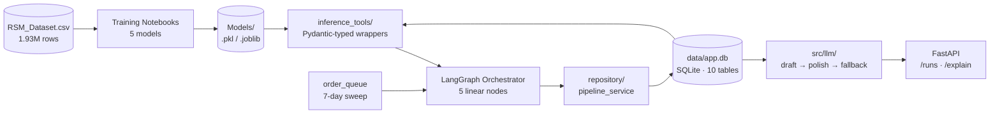
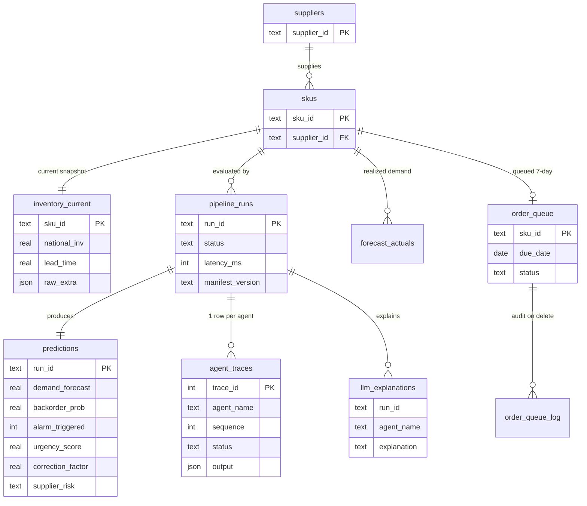
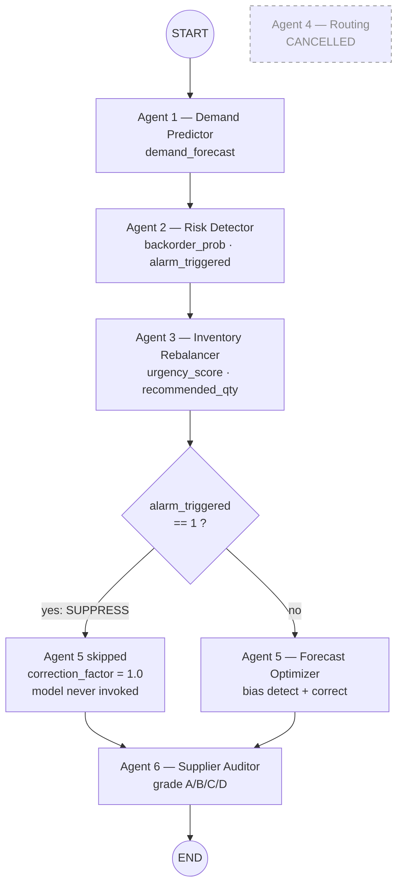
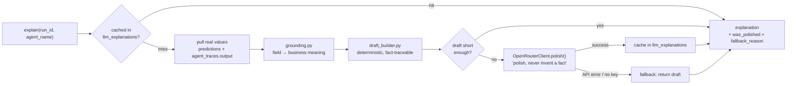

# Presentation Deck Plan — Agentic Supply Chain AI

A ≤10-slide deck showing project progress **from inference-tool building through LLM integration**, built around screenshots of real outputs. Each slide holds at most 3 content blocks. This document gives the slide-by-slide layout, the exact command to run for every screenshot, and Mermaid source for every diagram.

**Verified state of the repo as of 2026-07-28** (numbers taken from the live repo, not from the docs):

- 179 tests collected · 10 DB tables · 5 agents wired in LangGraph · 5000 seeded SKUs · 7 real pipeline runs already in `data/app.db`
- All model artifacts are real files on disk (LFS already pulled) — the "needs LFS" warnings in `run_commands/RUN_COMMANDS.txt` and `VERIFICATION_COMMANDS.txt` are **stale**; every tool runs
- **No `.env` exists** → the LLM layer runs in graceful-fallback (draft-only) mode, and `uvicorn` will **refuse to start** (`src/api/main.py:28`). See Pre-flight.

---

## Pre-flight (once, before capturing anything)

```bash
cd /Users/home/Documents/Projects/Updated-Supply-Chain-Agentic_AI
./venv/bin/python -m src.orchestrator.manifest        # validates all 5 model artifacts load
mkdir -p slides/shots                                  # where your screenshots go
```

**Decision on the LLM key.** Without `OPENROUTER_API_KEY`, slides 8–9 show fallback-only output and the API won't boot. Two options:

- **(A) Set a real key** in `.env` (`OPENROUTER_API_KEY=sk-or-...`) → slide 8 shows genuine LLM-polished text and slide 9's server starts. Best for the deck.
- **(B) No key** → slide 8 becomes a graceful-degradation proof (a legitimate, defensible story: the draft-first design), and slide 9 uses the pytest API tests instead of a live server.

Pick one before capturing slide 8. Both paths are spelled out below.

**Terminal setup for readable screenshots:** ~100 columns wide, large font, one consistent colour scheme across all shots. Capture the command line *and* its output in every shot.

---

## Slide 1 — Title & System at a Glance

**Layout:** title block on top, one full-width diagram below, 3 stat chips at the bottom.

**Content**

- Title: *Agentic AI for Supply Chain Management — 5-Agent Pipeline with Grounded LLM Explanations*
- Subtitle: your name / course / date
- Stat chips: **5 agents** · **10 DB tables** · **179 tests passing**

**Diagram D1 — architecture.** The whole system in one picture; you'll refer back to this slide repeatedly.



**Screenshot:** none. Diagram only.

---

## Slide 2 — Data & Trained Models

**Layout:** 3 blocks — dataset facts / model table / one screenshot.

**Content**

1. **Dataset:** `Dataset/RSM_Dataset.csv` — 1.93M rows, 21 raw features. Target `went_on_backorder` is deliberately **excluded** from the database (leakage guard).
2. **Model table** — real numbers, read from the artifacts:

| Agent | Model | Key metric |
|---|---|---|
| 1 Demand Predictor | regression (h=6) | 336 MB artifact, bit-exact parity vs notebook |
| 2 Risk Detector | stacking ensemble | ROC-AUC **0.965**, recall 0.574 @ threshold **0.945** |
| 3 Inventory Rebalancer | XGBoost | Spearman ρ **0.976** vs 0.124 linear baseline (p ≈ 1.7e-165) |
| 5 Forecast Optimizer | LGBM / CatBoost / XGB | MAPE 1771 → **723** (human vs agent) |
| 6 Supplier Auditor | classifier | ROC-AUC 0.98, MCC 0.76 on a 3.7% minority class |

3. **Honest caveat callout** (keep it — it reads as rigour, not weakness): *Supplier Auditor grades 91% of SKUs "D" because its training label `stop_auto_buy` is 96.34% positive in the source data. Root-caused, not a bug — flagged for retrain.*

**Screenshot S2 — data-quality audit**

```bash
./venv/bin/python -m audits.csv_quality_audit
```

→ `slides/shots/s2_audit.png`. Capture the summary block (row/column counts, SKU-cardinality case, finding count).

---

## Slide 3 — Step 1: Inference Tools (the wrapper layer)

**Layout:** 3 blocks — the contract / the 5 tools / screenshots.

**Content**

1. **The problem:** notebooks aren't callable. Each model needed a typed, cached, testable wrapper.
2. **The contract** (`inference_tools/schemas.py`): Pydantic input/output models per agent · `functools.lru_cache` model loading (load once per process) · explicit exception types · **zero LangChain/LangGraph inside a tool**, so every tool stays unit-testable standalone.
3. **All 5 shipped:** `demand_predictor_tool` · `risk_detector_tool` · `inventory_rebalancer_tool` · `forecast_optimizer_tool` · `supplier_auditor_tool`

**Screenshot S3a — one tool running end to end.** Risk Detector is the most visual: it prints probability, label, high-risk flag, and threshold.

```bash
./venv/bin/python run_risk_detector_example.py
```

→ `slides/shots/s3a_risk_tool.png`

**Screenshot S3b — the tool test suite** (proves it isn't a one-off script)

```bash
./venv/bin/python -m pytest tests/test_risk_detector_tool.py tests/test_demand_predictor_tool.py -q
```

→ `slides/shots/s3b_tool_tests.png`

*Optional third output, if the slide has room:* `./venv/bin/python run_supplier_auditor_example.py` — shows the A/B/C/D grading engine.

---

## Slide 4 — Step 2: Database Schema

**Layout:** ER diagram takes ~70% of the slide, 2 short callouts beside or below it.

**Content**

1. **10 tables**, SQLAlchemy 2.0 + SQLite, foreign keys and WAL enforced via PRAGMA (`src/db/base.py`).
2. **The schema enforces the science, not just the data** — two load-bearing CHECK constraints:
   - `urgency_score` ∈ [0, 1]
   - **suppression invariant:** `alarm_triggered = 1 ⟹ correction_factor = 1.0` — the database physically cannot store a run where an alarm was raised *and* the forecast was reduced.

**Diagram D2 — ER**



**Screenshot S4 — schema verification**

```bash
./venv/bin/python -m src.db.verify_db
```

→ `slides/shots/s4_verify_db.png` — capture the checks list ending in **SCHEMA OK**. Strong slide: it *proves* the constraints rather than claiming them.

---

## Slide 5 — Step 3: Orchestration (LangGraph)

**Layout:** pipeline diagram on the left/top, 2 callouts on the right/bottom.

**Content**

1. **5 linear nodes:** `START → demand → risk → rebalancer → forecast_opt → auditor → END` (`src/orchestrator/graph.py`). Agent 4 (routing) was cancelled by design — a direct edge, no dead node left behind.
2. **Manifest versioning:** every run stamps a sha256 fingerprint over all model artifacts (path / size / mtime), so any prediction is traceable to the exact model files that produced it.
3. **The novelty — risk suppression:** if Agent 2 raises `alarm_triggered=1`, Agent 5 short-circuits to `correction_factor=1.0` *without invoking its model*, and writes an `agent_traces` row with `status="skipped"`, `note="suppressed: alarm_triggered=1"`. Safety logic is never overruled by a forecast reduction.

**Diagram D3 — pipeline + suppression**



**Screenshot S5 — the orchestrator test suite**

```bash
./venv/bin/python -m pytest tests/orchestrator/ -v
```

→ `slides/shots/s5_orchestrator_tests.png`. If the output is long, frame the shot on the `test_suppression.py` and `test_graph_topology.py` lines.

---

## Slide 6 — Live Demo: One SKU, Two Outcomes

**Layout:** two screenshots side by side + one caption line. This is the money slide — the suppression invariant firing on real data.

**Caption:** *Same pipeline, same code path, two seeded SKUs — the alarm changes the outcome.*

**Screenshot S6a — normal SKU (no alarm)**

```bash
./venv/bin/python -m scripts.run_single_prediction --sku-id 1111949
```

→ `slides/shots/s6a_normal.png`. Values already in the DB: `demand_forecast=2.05`, `backorder_prob=0.130`, `alarm_triggered=0`, `urgency_score=0.290`, `correction_factor=1.105`, `supplier_risk=D`.

**Screenshot S6b — alarm-positive SKU (suppression fires)**

```bash
./venv/bin/python -m scripts.run_single_prediction --sku-id 1113111
```

→ `slides/shots/s6b_alarm.png`. Values: `backorder_prob=0.966`, `alarm_triggered=1`, **`correction_factor=1.0`**, and the `forecast_optimizer` trace row reads `status=skipped`.

**Annotate in PowerPoint:** red box around `alarm_triggered=1` + `correction_factor=1.0` in S6b, and around the `skipped` trace row. Circle `correction_factor=1.105` in S6a for contrast.

---

## Slide 7 — Order Queue & New-SKU Onboarding

**Layout:** 3 blocks — the 7-day window / onboarding flow / screenshot.

**Content**

1. **`order_queue` + `order_queue_log`** — a SKU enters with a `due_date`; a daily sweep evaluates everything due and marks expired entries. Every deletion is written to the log table first — no silent drops.
2. **`scripts/add_new_sku.py`** — interactive onboarding: prompts for the raw "mother" feature values, inserts into `skus` + `inventory_current`, enqueues, then shows the **engineered** features the system derives on its own (`safety_gap`, `perf_gap`, `inv_velocity`, `sales_trend`). The point: the operator supplies raw values only.
3. The queue is currently empty (0 rows) — built and tested plumbing, awaiting production use.

**Screenshot S7a — onboard a demo SKU and run it immediately**

```bash
./venv/bin/python -m scripts.add_new_sku --sku-id SKU-DEMO-001 --due-in-days 3 --run-now
```

→ `slides/shots/s7a_add_sku.png`. It prompts for raw values interactively — press Enter to leave a field NULL (nullable by design), or pre-fill with repeatable `--set col=value` flags, e.g. `--set national_inv=120 --set lead_time=8`. **Capture the engineered-features block** — that's the interesting part.

**Screenshot S7b — queue tests**

```bash
./venv/bin/python -m pytest tests/queue/ -q
```

→ `slides/shots/s7b_queue_tests.png`

> ⚠️ S7a **writes to `data/app.db`**. That's fine and reversible (delete the row from `skus` / `inventory_current` / `order_queue`), but capture slides 4 and 6 first if you want a clean DB state in those shots. The capture order below already handles this.

---

## Slide 8 — Step 4: LLM Integration (the destination)

**Layout:** flow diagram on top, 2 blocks below.

**Content**

1. **Draft-first, never invent.** A deterministic draft is assembled from real `predictions` + `agent_traces` values, grounded in `src/llm/grounding.py` (the documented meaning of every field and value). The LLM's only job is to *polish wording* — it is never asked to produce a fact.
2. **Graceful fallback.** Any API failure, timeout, or missing key returns the draft verbatim with `was_polished=False` and a `fallback_reason`. The feature cannot break the pipeline. Results are cached in `llm_explanations`, keyed by run + agent.
3. **Cloud, not local.** OpenRouter over `httpx` — no local model download, no GPU/RAM cost. (A local BART was explicitly dropped for exactly this reason.)

**Diagram D4 — explanation flow**



**Screenshot S8 — real SKUs through the pipeline, then explained**

```bash
./venv/bin/python run_llm_explanation_example.py --sku-id 1111949 --sku-id 1113111
```

→ `slides/shots/s8_llm.png`. Capture the `--- llm explanation (whole run) ---` block showing `was_polished`, `fallback_reason`, `model_used`, and the explanation text.

- **With a key (option A):** `was_polished=True`. Place the polished paragraph next to the slide-6 numbers it came from — that visually proves every number traces back.
- **Without a key (option B):** `was_polished=False`, `fallback_reason` populated, `model_used=no-key-configured`. Retitle the block *"Graceful degradation: the deterministic draft"* and present it as designed behaviour — which it is.

**Screenshot S8b (optional third block) — the LLM test suite**

```bash
./venv/bin/python -m pytest tests/llm/ -q
```

→ `slides/shots/s8b_llm_tests.png` — 20 tests, all against a stub client, zero real network calls.

---

## Slide 9 — API Layer (frontend-ready)

**Layout:** endpoint list + 1–2 screenshots.

**Content**

1. **FastAPI** (`src/api/`) — fails fast at startup if `OPENROUTER_API_KEY` is missing, rather than failing on the first user click.
2. **Endpoints:**
   - `GET /runs` — recent runs; `?sku_id=` filter, `?limit=` (default 20, max 100)
   - `GET /runs/{run_id}` — run status/timing + prediction row + all agent traces in order
   - `POST /predictions/{run_id}/explain` — on-demand explanation
3. **Contract-first:** the frontend consumes the API/DB contract, never model internals — so a model retrain requires no frontend change.

**Screenshot S9 — pick per your key decision**

**With a key (option A) — live server:**

```bash
# terminal 1
./venv/bin/uvicorn src.api.main:app --reload

# terminal 2
curl -s "http://127.0.0.1:8000/runs?limit=3" | ./venv/bin/python -m json.tool
```

→ `slides/shots/s9_api.png`. Even better: screenshot **http://127.0.0.1:8000/docs** — the auto-generated Swagger UI looks polished and shows all three endpoints at once.

**Without a key (option B) — the tests instead:**

```bash
./venv/bin/python -m pytest tests/api/ tests/llm/test_explanations_router.py -v
```

→ `slides/shots/s9_api_tests.png`

---

## Slide 10 — Results, Verification & Next Steps

**Layout:** 3 blocks — test-suite screenshot / what's proven / what's next.

**Content**

1. **Verification:** 179 tests, zero regressions across the build-out (154 → 174 → 179 as the LLM layer and API landed).
2. **What's proven end to end:** raw CSV → typed inference tools → constraint-enforcing DB → LangGraph pipeline with a DB-level safety invariant → grounded, fallback-safe LLM explanations → REST API.
3. **Next steps** (be candid — it reads as maturity):
   - Retrain Supplier Auditor; `stop_auto_buy` may encode "auto-reorder disabled" rather than "supplier untrustworthy"
   - Port `demand_velocity_band` / `stockout_risk` from the notebook into the production wrapper (they return `None` today)
   - Frontend on the read endpoints
   - Alembic migrations once real data is loaded (the schema currently uses `create_all`)

**Screenshot S10 — the whole suite**

```bash
./venv/bin/python -m pytest -q
```

→ `slides/shots/s10_all_tests.png`. Capture the final summary line (`179 passed`). Run this **last**, after slide 7's DB write, so the number is honest.

---

## Rendering the Mermaid diagrams to PNG

**Fastest, zero install:** paste each block into <https://mermaid.live> → *Actions → PNG* → drop into PowerPoint. Set the theme to match your slide background.

**CLI (batch), if you prefer:**

```bash
npm install -g @mermaid-js/mermaid-cli     # one time
mkdir -p slides/diagrams
# save each diagram block above as slides/diagrams/d1.mmd … d4.mmd, then:
for d in slides/diagrams/*.mmd; do
  mmdc -i "$d" -o "${d%.mmd}.png" -b transparent -w 2400
done
```

`-w 2400` renders wide enough to stay crisp when scaled into a slide; `-b transparent` lets the diagram sit on any slide background.

---

## Capture order (one pass, minimal re-running)

| # | Command | Shot |
|---|---|---|
| 0 | `./venv/bin/python -m src.orchestrator.manifest` | — (sanity check) |
| 1 | `./venv/bin/python -m audits.csv_quality_audit` | s2_audit |
| 2 | `./venv/bin/python run_risk_detector_example.py` | s3a_risk_tool |
| 3 | `./venv/bin/python -m pytest tests/test_risk_detector_tool.py tests/test_demand_predictor_tool.py -q` | s3b_tool_tests |
| 4 | `./venv/bin/python -m src.db.verify_db` | s4_verify_db |
| 5 | `./venv/bin/python -m pytest tests/orchestrator/ -v` | s5_orchestrator_tests |
| 6 | `./venv/bin/python -m scripts.run_single_prediction --sku-id 1111949` | s6a_normal |
| 7 | `./venv/bin/python -m scripts.run_single_prediction --sku-id 1113111` | s6b_alarm |
| 8 | `./venv/bin/python run_llm_explanation_example.py --sku-id 1111949 --sku-id 1113111` | s8_llm |
| 9 | `./venv/bin/python -m pytest tests/llm/ -q` | s8b_llm_tests |
| 10 | `/docs` screenshot (option A) **or** `./venv/bin/python -m pytest tests/api/ -v` (option B) | s9_api |
| 11 | `./venv/bin/python -m scripts.add_new_sku --sku-id SKU-DEMO-001 --due-in-days 3 --run-now` | s7a_add_sku |
| 12 | `./venv/bin/python -m pytest tests/queue/ -q` | s7b_queue_tests |
| 13 | `./venv/bin/python -m pytest -q` | s10_all_tests |

Steps 11–12 come late on purpose: step 11 writes to the database, so everything that benefits from a clean DB state is captured first, and step 13 re-runs the full suite afterwards so the headline number reflects the final state.
